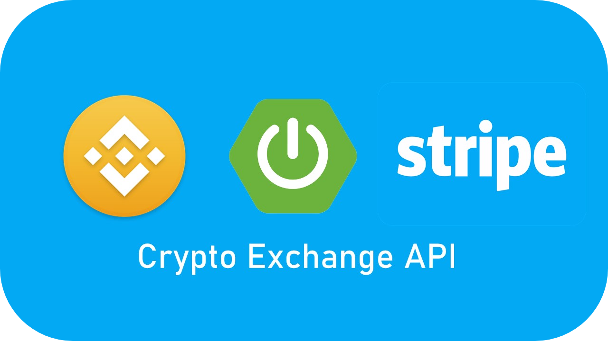
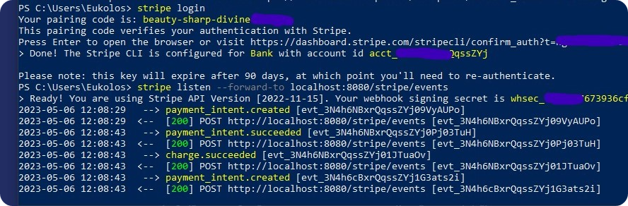
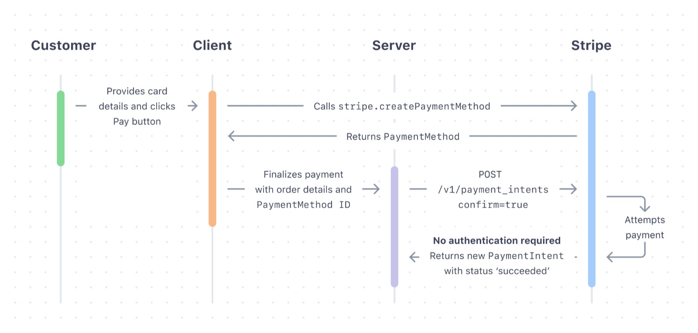

# Crypto Exchange API

Crypto Exchange API is a Spring Boot project designed to serve as a crypto exchange platform. It allows users to make payments using the Stripe API and fetches the latest crypto rates from Binance.

## Table of Contents

- [Dependencies Used](#dependencies-used)
- [Steps](https://github.com/Eukolos/crypto-exchange/blob/master/STEPS.md)
- [Features](#features)
- [Setup and Installation](#setup-and-installation)
- [Usage](#usage)
- [Contributing](#contributing)
- [License](#license)

## Dependencies Used
- [Spring Framework](https://docs.spring.io/spring-framework/docs/current/reference/html/)
  - [Spring Boot](https://spring.io/projects/spring-boot)
  - [Spring Web](https://docs.spring.io/spring-framework/docs/3.2.x/spring-framework-reference/html/mvc.html)
  - [Spring Data](https://spring.io/projects/spring-data-jpa)
  - [Spring Validation](https://docs.spring.io/spring-framework/docs/4.1.x/spring-framework-reference/html/validation.html)
- [H2 Database](https://www.h2database.com/html/main.html)
- [Stripe Api](https://stripe.com/docs)
- [Binance](https://www.binance.com/en/binance-api)
- [Google's Gson](https://sites.google.com/site/gson/gson-user-guide)
- [Thymeleaf](https://www.thymeleaf.org/documentation.html)

## Features

- **Payment Integration:** The project has been integrated with Stripe API, enabling users to make payments securely and conveniently.
  - _**The Stripe API listens to a specific URL for notifications**_
    
  - _**Stripe Payment Flow**_
    
  - _**Stripe Payment**_
        
- **Real-time Crypto Rates:** The project fetches real-time crypto rates from Binance, ensuring that users always get the latest rates.
- **User-friendly Interface:** The platform offers a simple and intuitive user interface that makes it easy for users to navigate and perform transactions.
- **Secure Transactions:** The platform ensures that all transactions are safe and secure, with measures in place to prevent fraud and protect user data.
- **Customizable:** The project is highly customizable, allowing you to configure it to suit your specific needs.
